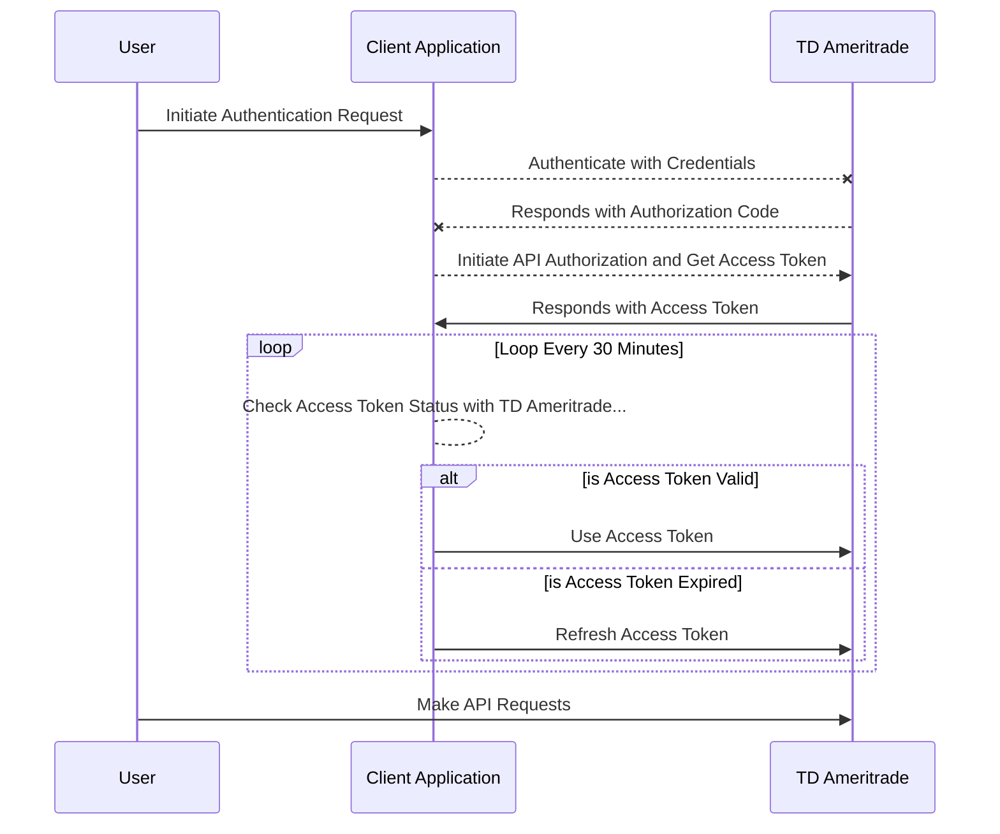

## TD Ameritrade Developer Account / Client Application ID

Follow the instructions provided by Charles Schwab / TD Ameritrade to create a developer account / create a application client ID.

## Authentication & Authorization
```javascript
// Step 1: Initiate Authentication request with TD Ameritrade's servers
// Follow the instructions provided by Charles Schwab / TD Ameritrade.

// Step 2: Get Authorization Response code from the query string to your redirect callback URL.
const searchParams = new URLSearchParams(window.location.search);
const authorizationResponseCode = searchParams.get('code');

// Step 3: Authorize the API Client and retrieve an Access Token
const { data: authResponse } = await tdApi.authenticate(authorizationResponseCode);
```

## Setting Access Token Externally
```javascript
const USER_ACCESS_TOKEN = authResponse?.access_token;
const REFRESH_TOKEN = authResponse?.refresh_token;

// Set User Access Token externally 
tdApi.setUserAccessToken({
  userAccessToken: USER_ACCESS_TOKEN,
  accessTokenExpires: authResponse?.expires_in,
  refreshToken: REFRESH_TOKEN,
  refreshTokenExpires: authResponse?.refresh_token_expires_in,
});
```

## Automatically Refresh Access Token with `startAccessTokenExpirationMonitor`
**The `startAccessTokenExpirationMonitor` method will check for access token expiration every 1 minute and will refresh for you when nearing expiry**

```javascript
// Call `startAccessTokenExpirationMonitor` with 
// an optional callback function to access and save updated credentials data
tdApi.startAccessTokenExpirationMonitor((credentials) => {
  console.log(credentials);

  // SAVE CREDENTIALS TO FILE SYSTEM FOR FUTURE USAGE...
});
```

## Periodically Refresh Access Token Manually.
```javascript
// Set User Access Token externally 
const { data: refreshTokenResponse } = tdApi.refreshAcccessToken(REFRESH_TOKEN);
```

## Sequence Diagram


Copyright (c) 2019 - 2023 Allen Sarkisyan. XT-TX. All Rights Reserved.