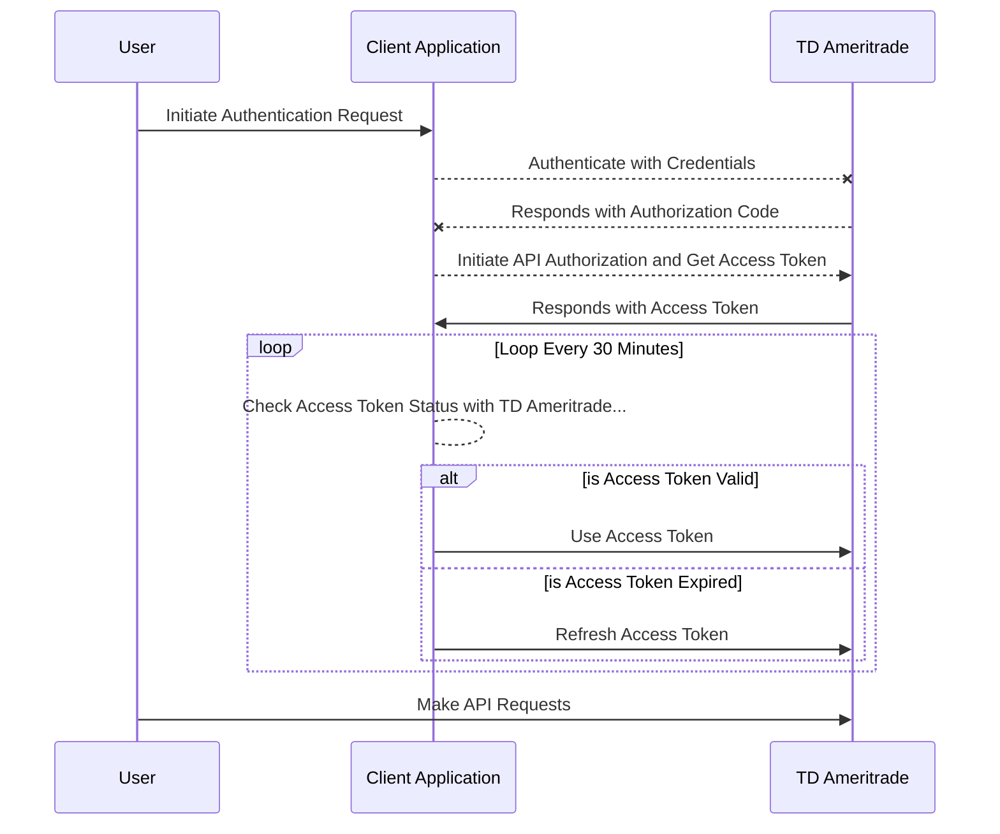

# README

# JavaScript / TypeScript TD Ameritrade API Client Implementation

[](https://npmjs.com/@allensarkisyan/schwab-td-ameritrade-api)
[](LICENSE.md)


## Overview

This is an unofficial JavaScript/TypeScript client implementation for the Charles Schwab / TD Ameritrade API. It allows developers to interact with TD Ameritrade's services and access financial data programmatically. Please note that this implementation is not affiliated with or endorsed by Charles Schwab and/or TD Ameritrade.

### WebSocket client / streaming functionality available with [@allensarkisyan/schwab-td-ameritrade-streamer](https://github.com/allensarkisyan/schwab-td-ameritrade-streamer)

## Features

- MIT Licensed: This project is fully open source and available under the MIT License.
- Cross-Platform: It is designed to work in both Node.js and Browser environments.
- Strongly Typed: The codebase is strongly typed using JSDoc annotations for enhanced code quality and autocompletion support in TypeScript.
- Uses Zod: [Zod](https://github.com/colinhacks/zod) (for type safety / schema validation)
- Implementation of Official API Endpoints: [Official TD Ameritrade API Documentation](https://developer.tdameritrade.com/apis)
- Derived from proprietary & internally developed quantitative trading and research software.

## Installation

To install and use this TD Ameritrade API client, you can add it to your project using npm or yarn:

```bash
npm install @allensarkisyan/schwab-td-ameritrade-api
```

```bash
yarn add @allensarkisyan/schwab-td-ameritrade-api
```

# Getting Started
To get started with this library, follow the documentation provided [here](https://allensarkisyan.github.io/schwab-td-ameritrade-api/getting-started) for detailed instructions on how to set up and use the client to access TD Ameritrade's API.

# See [Examples](https://allensarkisyan.github.io/schwab-td-ameritrade-api/EXAMPLES)

## Required Configuration Options / Environment Variables
| Environment Variable | Option Name | Value |
| ----------- | ----------- | ------------- |
| TD_AMERITRADE_CLIENT_ID | clientId | YOUR_TD_AMERITRADE_APPLICATION_CLIENT_ID |
| TD_AMERITRADE_CALLBACK_URL | callbackUrl | http://localhost:3000/tdcallback |


## Import Module
```javascript
/** Using ECMAScript Modules */
import { TDAmeritradeAPI } from '@allensarkisyan/schwab-td-ameritrade-api';

/** Using CommonJS */
const { TDAmeritradeAPI } = require('@allensarkisyan/schwab-td-ameritrade-api');
```

## API Client Initialization
```javascript
/** Create a new instance of TDAmeritradeAPI */
const tdApi = new TDAmeritradeAPI({
  clientId: process.env.TD_AMERITRADE_CLIENT_ID,
  callbackUrl: process.env.TD_AMERITRADE_CALLBACK_URL
});
```

#### createTDAmeritradeAPIClient Factory
```javascript
import { createTDAmeritradeAPIClient } from '@allensarkisyan/schwab-td-ameritrade-api';

const tdApi = createTDAmeritradeAPIClient({
  clientId: process.env.TD_AMERITRADE_CLIENT_ID,
  callbackUrl: process.env.TD_AMERITRADE_CALLBACK_URL
});
```

## Authentication & Authorization
```javascript
// Step 1: Initiate Authentication request with TD Ameritrade's servers
// Follow the instructions provided by Charles Schwab / TD Ameritrade.

// Step 2: Get Authorization Response code from the query string to your redirect callback URL.
const searchParams = new URLSearchParams(window.location.search);
const authorizationResponseCode = searchParams.get('code');

// Step 3: Authorize the API Client and retrieve an Access Token
const { data: authResponse } = await tdApi.authenticate(authorizationResponseCode);
```

## Setting Access Token Externally
```javascript
const USER_ACCESS_TOKEN = authResponse?.access_token;
const REFRESH_TOKEN = authResponse?.refresh_token;

// Set User Access Token externally 
tdApi.setUserAccessToken({
  userAccessToken: USER_ACCESS_TOKEN,
  accessTokenExpires: authResponse?.expires_in,
  refreshToken: REFRESH_TOKEN,
  refreshTokenExpires: authResponse?.refresh_token_expires_in,
});
```



## Available APIs
NONE: :x:

PARTIAL: :white_square_button:

FULL: :heavy_check_mark:

| APIs | AVAILABLE | IMPLEMENTATION |
| ---------| ----------  | ------ |
| Accounts & Trading | :heavy_check_mark: | :white_square_button: |
| Authentication | :heavy_check_mark: | :heavy_check_mark: |
| Instruments | :heavy_check_mark: | :white_square_button: |
| Market Hours | :x: | :x: |
| Movers | :heavy_check_mark: | :heavy_check_mark: |
| Option Chains | :heavy_check_mark: | :heavy_check_mark: |
| Price History | :heavy_check_mark: | :heavy_check_mark: |
| Quotes | :heavy_check_mark: | :white_square_button: |
| Transaction History | :heavy_check_mark: | :white_square_button: |
| User Info & Preferences | :x: | :white_square_button: |
| Watchlist | :heavy_check_mark: | :white_square_button: |

## License
This project is licensed under the MIT License - see the [LICENSE](LICENSE.md) file for details.

MIT License

Copyright (c) 2023 Allen Sarkisyan

Permission is hereby granted, free of charge, to any person obtaining a copy
of this software and associated documentation files (the "Software"), to deal
in the Software without restriction, including without limitation the rights
to use, copy, modify, merge, publish, distribute, sublicense, and/or sell
copies of the Software, and to permit persons to whom the Software is
furnished to do so, subject to the following conditions:

The above copyright notice and this permission notice shall be included in all
copies or substantial portions of the Software.

THE SOFTWARE IS PROVIDED "AS IS", WITHOUT WARRANTY OF ANY KIND, EXPRESS OR
IMPLIED, INCLUDING BUT NOT LIMITED TO THE WARRANTIES OF MERCHANTABILITY,
FITNESS FOR A PARTICULAR PURPOSE AND NONINFRINGEMENT. IN NO EVENT SHALL THE
AUTHORS OR COPYRIGHT HOLDERS BE LIABLE FOR ANY CLAIM, DAMAGES OR OTHER
LIABILITY, WHETHER IN AN ACTION OF CONTRACT, TORT OR OTHERWISE, ARISING FROM,
OUT OF OR IN CONNECTION WITH THE SOFTWARE OR THE USE OR OTHER DEALINGS IN THE
SOFTWARE.

## Contributing
Contributions are welcome! If you have suggestions, bug reports, or would like to contribute to this project,
please open an issue or submit a pull request.

## Author

[Allen Sarkisyan](https://github.com/allensarkisyan)

Copyright (c) 2019 - 2023 Allen Sarkisyan. XT-TX. All Rights Reserved.
